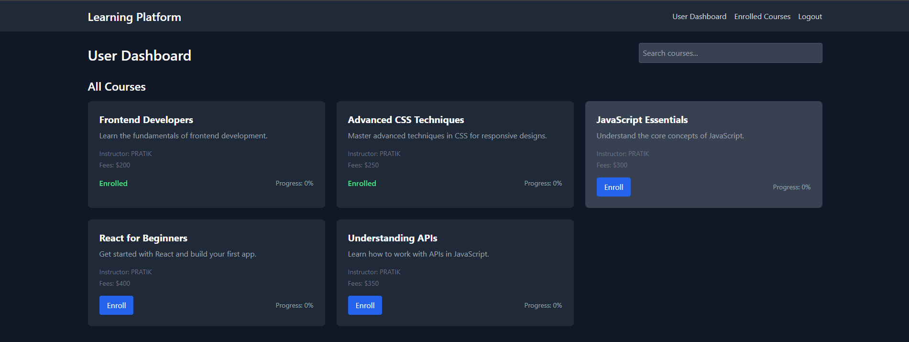
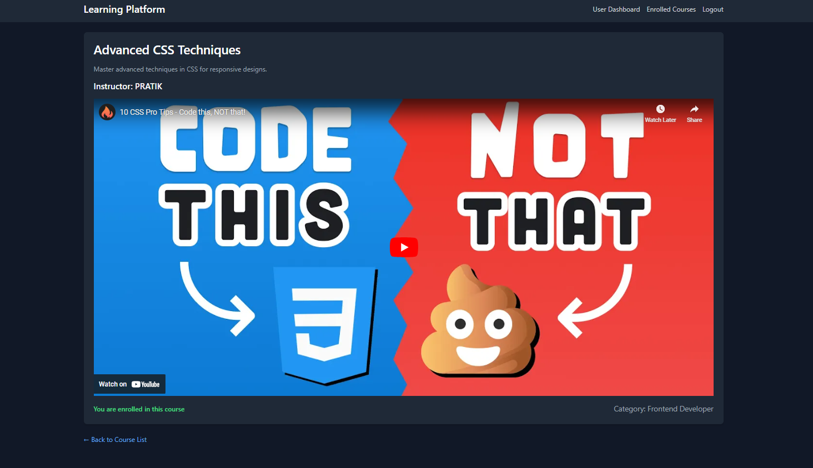
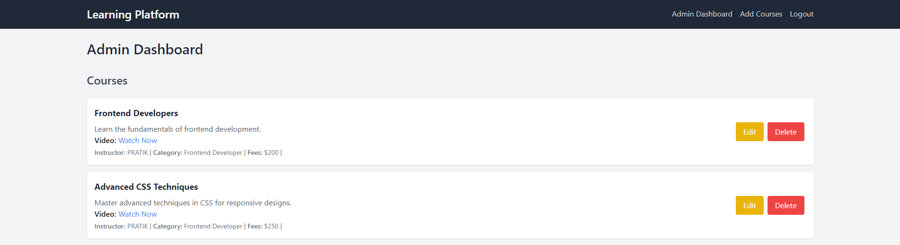

# Online Learning Platform (Create React App)

## Project Overview
The Online Learning Platform is a web application designed to facilitate the browsing, enrollment, and completion of various online courses. The platform aims to provide users with an intuitive and engaging learning experience, while also empowering administrators to manage course content effectively. this website is available on : https://online-learning-platform-sage.vercel.app/

.
.
.


## Key Features
### User Features:
- Course Browsing: Users can browse through a catalog of courses, filter by category, and search for specific topics.
- Enrollment: Users can enroll in courses of their choice, gaining access to course materials and resources.
- Progress Tracking: Users can track their progress through enrolled courses and easily resume lessons at any time.
- Responsive Design: The application is fully responsive, ensuring a seamless experience across mobile, tablet, and desktop devices.
### Admin Features:
- Course Management: Administrators can add, update, and delete courses, allowing for easy management of course content.
- User Progress Monitoring: Admins can track user progress within the platform, ensuring that learners are making the most of their courses.
### Tech Stack
- Frontend: Built using React for a dynamic user interface, with Tailwind CSS for modern, responsive design.
- State Management: Utilizes React Context API for managing course enrollment and progress states.
- API Integration: Fetches course data and user progress from context api

## Getting Started
- Clone the Repository
```
   git clone https://github.com/desai-pratik/online-learning-platform.git
   cd online-learning-platform
```
- Install Dependencies:
```
npm install
```
- Run the Application:
```
npm start
```
